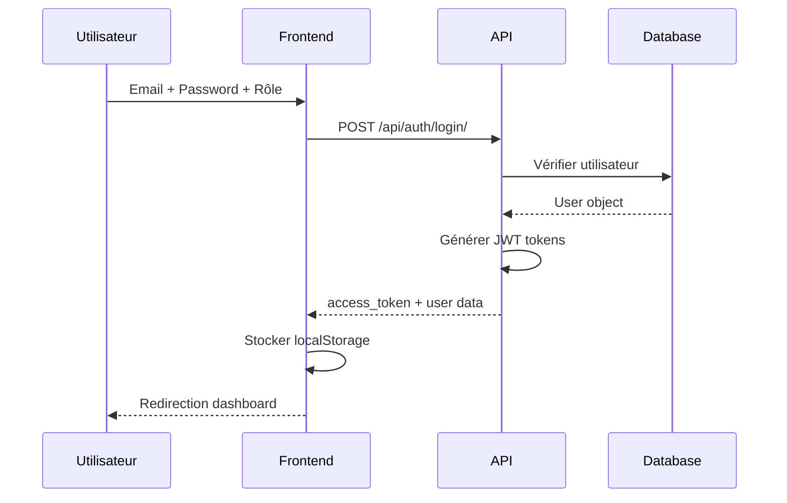
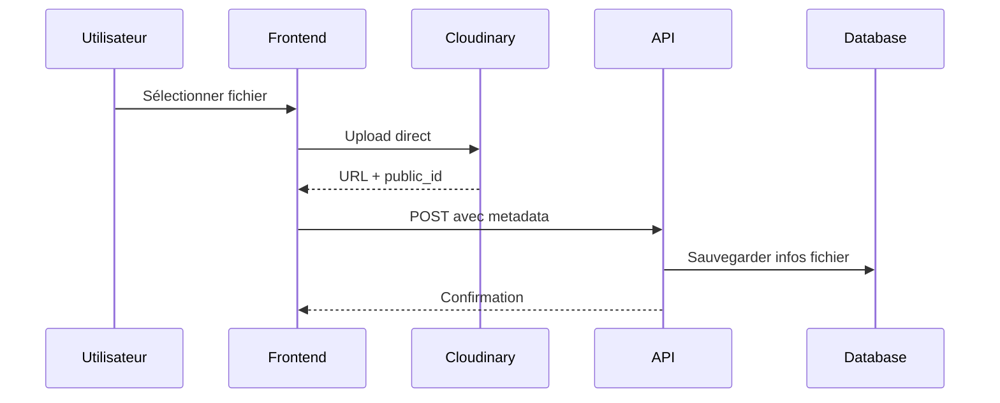

# 🏗️ Architecture Complète - Orchid Island Platform

## 📋 Vue d'Ensemble

Orchid Island est une plateforme de gestion de stage complète avec :
- **Frontend** : Application web responsive (Vercel)
- **Backend** : API REST Django (Railway)
- **Base de données** : PostgreSQL
- **Stockage fichiers** : Cloudinary
- **Authentification** : JWT tokens

---

## 🌐 Frontend Architecture

### 📁 Structure des Fichiers
```
frontend/
├── assets/
│   ├── config.js              # Configuration URLs backend
│   ├── common.js              # Fonctions partagées, auth, navigation
│   └── sidebar-template.html   # Template navigation
├── pages/
│   ├── authentification.html   # Page connexion/inscription
│   ├── dashboard.html         # Tableau de bord
│   ├── stagiaires.html       # Gestion stagiaires
│   ├── projets.html          # Gestion projets
│   ├── taches.html           # Gestion tâches
│   ├── rapports.html         # Dépôt rapports
│   ├── alertes.html          # Système d'alertes
│   ├── pointage_qr.html      # Pointage QR code
│   └── scan_mobile.html      # Pointage mobile
└── assets/                  # Styles, scripts, images
```

### 🎨 Technologies Frontend
- **HTML5** : Structure sémantique
- **CSS3** : Variables CSS, Grid, Flexbox, Animations
- **JavaScript Vanilla** : ES6+, Async/Await
- **Responsive Design** : Mobile-first approach
- **Cloudinary SDK** : Upload fichiers

### 🔧 Fonctionnalités Clés

#### 🎯 Authentification & Rôles
```javascript
// Rôles définis dans common.js
const ROLES = {
  ADMIN: 'admin',        # Accès complet
  RH: 'rh',            # Gestion stagiaires, rapports
  MANAGER: 'manager',    # Gestion projets, tâches
  STAGIAIRE: 'stagiaire'  # Dépôt rapports, pointage
}
```

#### 🔄 Système de Navigation
- **Fonction `navigateTo()`** : Gestion URLs selon environnement
- **Filtrage par rôle** : `filterNavByRole()` dans chaque page
- **Badges dynamiques** : Compteurs en temps réel

#### 💾 Stockage Local
```javascript
// localStorage structure
{
  user: { email, role, first_name, last_name },
  access_token: "JWT_token",
  orchidData: {
    projets: { list: [...] },
    stagiaires: [...],
    rapports: { list: [], finaux: [] }
  },
  orchid_shared_data: {
    alertes: [...],
    pointages: [...]
  }
}
```

---

## 🛠️ Backend Architecture

### 📁 Structure Django
```
backend/
├── orchid_backend/
│   ├── settings.py          # Configuration Django
│   ├── urls.py             # Routing principal
│   └── wsgi.py            # Déploiement
├── users/                  # Gestion utilisateurs
│   ├── models.py          # CustomUser, rôles
│   ├── views.py           # Auth, CRUD users
│   └── permissions.py     # Permissions personnalisées
├── stagiaires/            # Gestion stagiaires
│   ├── models.py          # Modèles stagiaires
│   ├── views.py           # API stagiaires
│   └── urls.py           # Routes stagiaires
├── projets/               # Gestion projets
│   ├── models.py          # Projet, tâches JSON
│   ├── views.py           # CRUD projets
│   └── urls.py           # Routes projets
├── rapports/              # Gestion rapports
│   ├── models.py          # Rapport, fichiers Cloudinary
│   ├── views.py           # Upload, validation rapports
│   └── urls.py           # Routes rapports
├── presences/             # Pointage, absences
│   ├── models.py          # Pointage, Absence
│   ├── views.py           # QR scan, justifications
│   └── urls.py           # Routes présences
└── taches/                # Gestion tâches
    ├── models.py          # Tâche, sous-tâches
    ├── views.py           # CRUD tâches
    └── urls.py           # Routes tâches
```

### 🎯 Technologies Backend
- **Django 4.x** : Framework web Python
- **Django REST Framework** : API REST
- **PostgreSQL** : Base de données principale
- **JWT Authentication** : SimpleJWT
- **Cloudinary** : Stockage fichiers CV/rapports
- **CORS** : Gestion cross-origin

### 🔐 Modèle Utilisateur
```python
class CustomUser(AbstractUser):
    ROLE_CHOICES = [
        ('admin', 'Admin'),
        ('rh', 'RH'),
        ('manager', 'Manager'),
        ('stagiaire', 'Stagiaire'),
    ]
    
    role = models.CharField(max_length=20, choices=ROLE_CHOICES)
    cv_url = models.URLField(blank=True)  # Cloudinary
    cv_public_id = models.CharField(max_length=255, blank=True)
    absences_non_justifiees = models.IntegerField(default=0)
    # ... autres champs
```

---

## 🔄 Flux de Données

### 📊 Architecture Client-Serveur
```
Frontend (Vercel) ←→ API REST (Railway)
     ↓                    ↓
  Local Storage         PostgreSQL
     ↓                    ↓
  Cloudinary ←→ Django Storage
```

### 🔐 Flux Authentification


### 📁 Flux Upload Fichiers


---

## 🎛️ Système de Permissions

### 📋 Matrice des Permissions
| Module | Admin | RH | Manager | Stagiaire |
|--------|-------|----|---------|------------|
| **Utilisateurs** | ✅ CRUD | ✅ CRUD | ❌ Lecture profil | ❌ |
| **Projets** | ✅ CRUD | ✅ Lecture | ✅ CRUD | ❌ Lecture seul |
| **Tâches** | ✅ CRUD | ✅ Lecture | ✅ CRUD | ❌ |
| **Rapports** | ✅ CRUD + Validation | ✅ CRUD + Validation | ✅ Lecture | ✅ Dépôt seul |
| **Pointages** | ✅ CRUD | ✅ CRUD | ✅ Lecture | ✅ Pointage QR |
| **Alertes** | ✅ CRUD | ✅ CRUD | ✅ Lecture | ✅ Lecture seule |

### 🔒 Permissions Django
```python
# users/permissions.py
class IsAdmin(BasePermission):
    def has_permission(self, request, view):
        return request.user.role == 'admin'

class IsAdminOrRH(BasePermission):
    def has_permission(self, request, view):
        return request.user.role in ['admin', 'rh']

class IsAdminOrRHOrManager(BasePermission):
    def has_permission(self, request, view):
        return request.user.role in ['admin', 'rh', 'manager']
```

---

## 📱 Modules Spécifiques

### 🎯 Gestion des Stagiaires
- **CRUD complet** : Création, lecture, modification, suppression
- **Upload CV** : Cloudinary avec preview
- **Gestion statuts** : Accepté, En attente, Refusé
- **Suivi absences** : Compteur automatique
- **Alertes automatiques** : Nouveau stagiaire, 3 absences

### 📁 Gestion des Projets
- **CRUD projets** : Titre, description, responsable
- **Système de tâches** : JSON intégré dans modèle Projet
- **Assignation responsable** : Lien avec utilisateurs
- **Suivi progression** : 0-100% avec statuts

### 📋 Gestion des Tâches
- **Kanban board** : 3 colonnes (À Faire, En Cours, Terminé)
- **Sous-tâches** : Structure hiérarchique
- **Priorités** : Haute, Moyenne, Basse avec couleurs
- **Filtrage par projet** : Vue par projet

### 📄 Gestion des Rapports
- **Deux types** : Journalier et Final
- **Upload fichiers** : PDF/DOCX via Cloudinary
- **Workflow validation** : Soumis → En attente → Validé/Refusé
- **Notifications WhatsApp** : Alertes automatiques après 17h

### ⏰ Pointage & Présences
- **QR Code scanning** : Pointage rapide
- **Mode mobile** : Interface scan dédiée
- **Gestion absences** : Déclaration, justification
- **Alertes automatiques** : 3 absences = blocage

### 🚨 Système d'Alertes
- **Multi-canal** : WhatsApp + Email
- **Types alertes** : Absences, rapports manquants, nouveaux stagiaires
- **Gestion priorités** : Critique, Avertissement, Info
- **Historique complet** : Traçabilité des alertes

---

## 🔧 Déploiement & Infrastructure

### 🌐 Environnements
```
Production:
├── Frontend: Vercel (https://orchid-island.vercel.app)
├── Backend: Railway (https://orchid-island-production.up.railway.app)
├── Database: PostgreSQL (Railway)
└── Storage: Cloudinary

Développement:
├── Frontend: Live Server (localhost:5500)
├── Backend: Django (localhost:8000)
├── Database: SQLite (local)
└── Storage: Local (dev)
```

### 🔄 Configuration Dynamique
```javascript
// assets/config.js
(function() {
  const hostname = window.location.hostname;
  if (hostname === '127.0.0.1' || hostname === 'localhost') {
    window.BACKEND_URL = 'http://127.0.0.1:8000';
  } else if (hostname.startsWith('192.168.')) {
    window.BACKEND_URL = `http://${hostname}:8000`;
  } else {
    window.BACKEND_URL = 'https://orchid-island-production.up.railway.app';
  }
})();
```

---

## 📊 Performance & Optimisations

### ⚡ Optimisations Frontend
- **Lazy loading** : Images et composants
- **LocalStorage** : Cache données fréquentes
- **Async patterns** : Non-blocking UI
- **CSS animations** : GPU accelerated
- **Responsive images** : Tailles adaptatives

### 🚀 Optimisations Backend
- **JWT tokens** : Authentification stateless
- **Database indexing** : Requêtes optimisées
- **Cloudinary CDN** : Distribution fichiers
- **CORS configuré** : Cross-origin sécurisé
- **Pagination** : Grandes datasets

---

## 🔒 Sécurité

### 🛡️ Mesures de Sécurité
- **JWT avec expiration** : Tokens renouvelables
- **Permissions granulaires** : Par rôle et module
- **CORS restrictif** : Origines autorisées
- **Validation inputs** : Django forms + JS
- **HTTPS obligatoire** : Transport sécurisé
- **Rate limiting** : Protection brute-force

### 🔐 Gestion des Mots de Passe
- **Hashing Django** : bcrypt par défaut
- **Complexité requise** : 6+ caractères
- **Stockage chiffré** : BDD sécurisée
- **Reset par email** : Flux récupération

---

## 📈 Scalabilité & Évolution

### 🔄 Architecture Modulaire
- **Django apps** : Modules indépendants
- **API REST** : Client découplé
- **Cloud storage** : Fichiers externes
- **State management** : Centralisé

### 🚀 Potentiels Extensions
- **Notifications push** : WebSocket/Service Workers
- **Analytics avancées** : Tableaux de bord
- **Mobile app** : React Native/Flutter
- **Intégrations SSO** : LDAP/OAuth2
- **Multi-tenant** : Plusieurs organisations

---

## 📝 Résumé Technique

| Composant | Technologie | Rôle |
|-----------|-------------|--------|
| **Frontend** | HTML5/CSS3/JS | Interface utilisateur |
| **Backend** | Django/DRF | API REST |
| **Database** | PostgreSQL | Persistance |
| **Storage** | Cloudinary | Fichiers |
| **Auth** | JWT | Sécurité |
| **Deploy** | Vercel/Railway | Hébergement |
| **CDN** | Cloudinary | Performance |

Orchid Island est une plateforme moderne, scalable et sécurisée pour la gestion complète de stages ! 🚀
